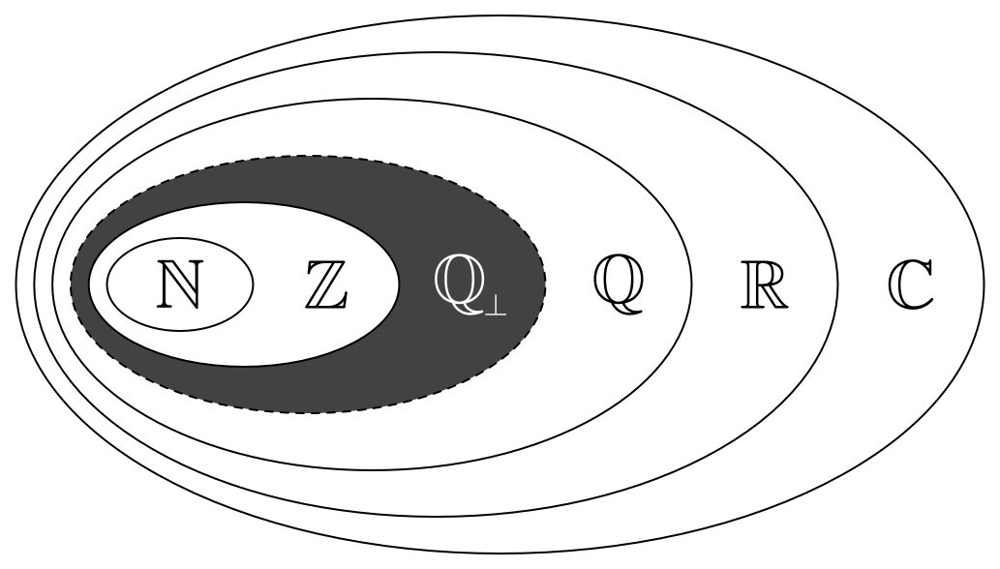
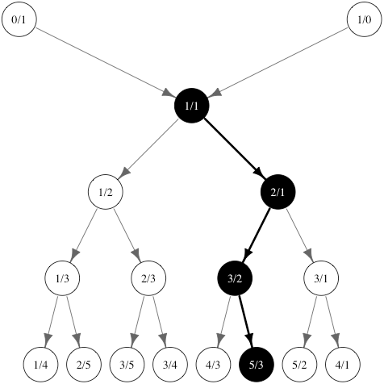

# SternBrocot


# TODO: document the plot capability

## Introduction

The **SternBrocot** R package provides a function for approximating real numbers 
as coprime rational fractions using the Stern-Brocot tree.

This package is ideal for applications requiring rational fraction approximations 
with configurable uncertainty bounds.

## The Stern-Brocot operator

The Stern-Brocot function maps a real value to the nearest coprime rational 
fraction bounded by lower and upper uncertainty parameters.

```r
stern_brocot(sqrt(2), c(0.02, 0.01)) # returns 7 / 5
```

$$x = \text{SB}(\sqrt{2} | 0.02, 0.01) = \frac{7}{5}$$

$$x = \text{SB}(\tilde{x} | \sigma^\lt_x, \sigma^\gt_x) = \frac{p}{q}$$

$$\sigma^\lt_x, \tilde{x}, \tilde{x} - \sigma^\lt_x, \sigma^\gt_x > 0$$

For simple approximations it is common for the lower and upper uncertainties to 
have the same value:

```r
stern_brocot(sqrt(2), 0.02) # returns 7 / 5
```

$$x = \text{SB}(\tilde{x} | \sigma_x) = \frac{p}{q}, \quad \sigma_x = \sigma^\lt_x = \sigma^\gt_x$$

Following Graham et al. [3], we use the $\perp$ sign to indicate $p$ and $q$ are coprime.

$$p \perp q \iff \gcd(p, q) = 1, \quad p, q \in \mathbb{N}^+$$

The Stern-Brocot tree restricts the range of possible values from the reals to 
the coprime rational fractions.

$$\mathbb{R} \to \mathbb{Q_\perp}$$

---

#### Coprime rational numbers



---

## The Stern-Brocot tree with path

Every unique path in the tree Stern-Brocot leads to a unique coprime fraction. 
We can encode the path as a binary set of choices where we start with `1` for the
`1/1` vertex followed by `0` for movement to the left and `1` for movement to the
right. In the figure below, the encoding would be to start with `1/1` as `1` 
followed by a right movement to `2/1` which would encode with another `1` followed 
by a movement to the left to `3/2` which we encode with a `0` followed by a movement
to the right to `5/3` which we encode with another `1`. So the full encoding would be:

Path encoding for `5/3`: `1101`

```r
stern_brocot(sqrt(3), 0.1) # returns 5 / 3
```

#### Metadata

Each result includes metadata about the approximation process, such as the depth 
of the Stern-Brocot tree traversal and path representation.

| x        | num | den | approximation |   error    | valid_min | valid_max | depth | path | path_id |
|----------|-----|-----|---------------|------------|-----------|-----------|-------|------|---------|
| 1.732051 |  5  |  3  |    1.666667   | -0.06538414| 1.632051 | 1.832051 |   4   | 1101 |    13   |




---

## Learn more about the Stern-Brocot tree

Check out the [Stern-Brocot tree](https://en.wikipedia.org/wiki/Stern–Brocot_tree) Wikipedia article.

Check out this delightful video from [Numberphile](https://www.youtube.com/watch?v=DpwUVExX27E).

[](https://www.youtube.com/watch?v=DpwUVExX27E)

---

## Installation

You can install the latest version of **SternBrocot** from GitHub:

```r
# Install SternBrocotR from GitHub
remotes::install_github("homeymusic/SternBrocotR")
```

---

## Definition

### Approximate a real number as a coprime rational fraction using the Stern-Brocot tree

This function approximates a real number as a coprime rational fraction using 
the Stern-Brocot tree. It supports specifying an uncertainty to determine how 
close the approximation should be to the real number.

### Usage
```r
stern_brocot(x, uncertainty)
```

### Arguments
- **`x`**: A single numeric value to approximate as a fraction.

- **`uncertainty`**: Either:
  - A single positive numeric value representing symmetrical uncertainty bounds `x - uncertainty, x + uncertainty`, or
  - A vector of two positive numeric values, where the first element is the lower uncertainty and the second is the upper uncertainty, defining the range `x - uncertainty[1], x + uncertainty[2]`.

### Value
A data frame with the following columns:
- **`x`**: The original value of `x`.
- **`num`**: The numerator of the approximated fraction (an integer).
- **`den`**: The denominator of the approximated fraction (a natural number > 0).
- **`approximation`**: The value of the fraction `num / den`.
- **`error`**: The difference between the approximation and the original value of `x`.
- **`valid_min`**: The lower bound of the uncertainty range.
- **`valid_max`**: The upper bound of the uncertainty range.
- **`depth`**: The depth of the Stern-Brocot tree traversal (number of steps taken).
- **`path`**: The path taken in the Stern-Brocot tree as a binary string.
- **`path_id`**: The binary path represented as an integer.

---

## Examples

Import the `SternBrocot` package for the examples.

```r
library(SternBrocot)
```

### Symmetrical Uncertainty

A symmetrical uncertainty parameter is the most common case and is useful for 
modeling scenarios with even boundary conditions, where the acceptable range for 
approximation is the same between lower and upper bounds.

```r
# Approximate the square root of two with symmetrical uncertainty
result <- stern_brocot(sqrt(2), uncertainty = 0.03)
print(result)
```

#### Output

| x        | num | den | approximation |      error | valid_min | valid_max | depth | path  | path_id |
|----------|-----|-----|---------------|------------|-----------|-----------|-------|-------|---------|
| 1.414214 | 7   | 5   | 1.4           | -0.014214  | 1.384214  | 1.444214  | 4     | 1010  | 10      |

### Asymmetrical Uncertainty

Asymmetrical uncertainty parameters are useful for modeling scenarios with 
uneven boundary conditions, where the acceptable range for approximation differs 
between lower and upper bounds.

```r
# Approximate the square root of two with asymmetrical uncertainty
result <- stern_brocot(sqrt(12), uncertainty = c(0.01, 0.02))
print(result)
```

#### Output

| x        | num | den | approximation |       error | valid_min | valid_max | depth | path   | path_id |
|----------|-----|-----|---------------|-------------|-----------|-----------|-------|--------|---------|
| 3.464102 | 38  | 11  | 3.454545      | -0.00955616 | 3.454102  | 3.484102  | 5     | 10100  | 20      |

## Citing SternBrocot

If you use this package in your research or publications, please cite it as follows:

> **Brian McAuliff Mulloy** (2025). *SternBrocot.* R package version 0.0.1. URL: [https://github.com/homeymusic/SternBrocotR](https://github.com/homeymusic/SternBrocotR)

You can also generate a citation in R:

```r
citation("SternBrocot")
```

---

## Features

- Approximate real numbers as coprime, rational fractions with configurable uncertainty bounds.
- Results include metadata like depth, error, and binary path representation.
- Efficient implementation of the Stern-Brocot tree algorithm.

---

## License

This package is licensed under the MIT License. See the [LICENSE](./LICENSE.md) file for more details.

---

## Contributing

Contributions are welcome! If you find a bug or have an idea for a new feature, please open an issue or submit a pull request on [GitHub](https://github.com/homeymusic/SternBrocotR).

---

## Acknowledgments

Special thanks to Stolzenburg [5] for conversations on his use of the Stern-Brocot 
tree to the psychophysics of music and to the R and C++ communities for creating 
tools like **Rcpp**, which make packages like this possible.

---

## References
The method is inspired by the algorithms described in:
1. Stern, M. (1858). Ueber eine zahlentheoretische Funktion. *Journal für die reine und angewandte Mathematik, 55*, 193–220.
2. Brocot, A. (1862). Calcul des rouages par approximation: Nouvelle méthode. *A. Brocot.*
3. Graham, R. L., Knuth, D. E., & Patashnik, O. (1994). *Concrete Mathematics* (2nd ed., pp. 115–123). Addison-Wesley.
4. Forišek, M. (2007). Approximating rational numbers by fractions. In *International Conference on Fun with Algorithms* (pp. 156–165). Berlin, Heidelberg: Springer Berlin Heidelberg.
5. Stolzenburg, F. (2015). Harmony perception by periodicity detection. *Journal of Mathematics and Music, 9*(3), 215–238.

